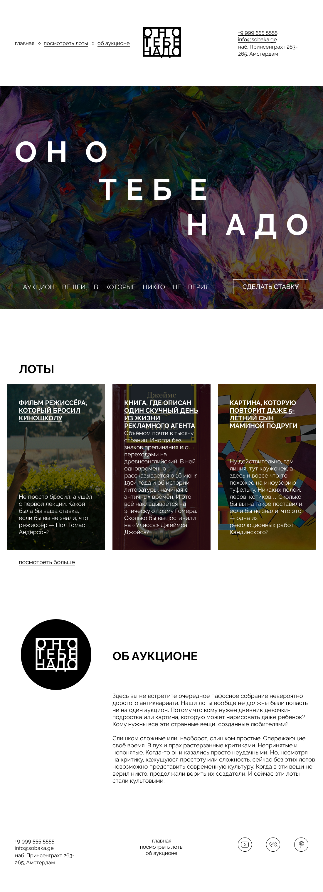

# Проект «Оно тебе надо»

## Содержание

- [Технологии](#технологии)
- [Описание проекта](#описание-проекта)
- [Скриншот проекта](#скриншот-проекта)
- [Ссылки](#ссылки)
- [Источники](#источники)

## Технологии

## Описание проекта

Проект представляет собой удобный типовой однастраничный сайт, предназначен для просмотра на большом мониторе.

## Скриншот проекта

## Ссылки

- [Репозиторий проекта](https://github.com/LeaTrixWizzer/ono-tebe-nado.git)
- [Макет проекта](https://www.figma.com/design/8KwhMpv8qnDocX4NVFQBpn/%D0%9E%D0%BD%D0%BE-%D1%82%D0%B5%D0%B1%D0%B5-%D0%BD%D0%B0%D0%B4%D0%BE?node-id=0-1&p=f&t=V5Q0DeyF5CawUffw-0)
- [Публикация проекта](https://leatrixwizzer.github.io/ono-tebe-nado/)

## Источники

@yandex-praktikum
